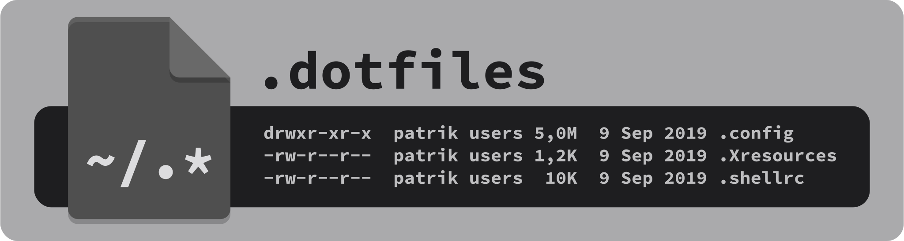
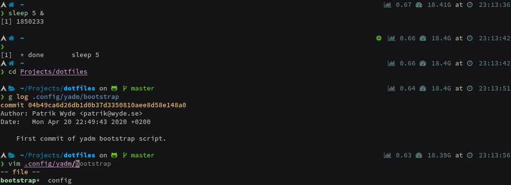
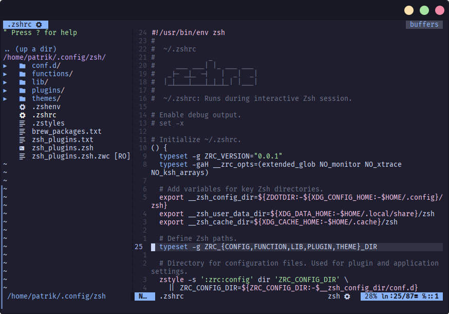

# :house: Dotfiles

<div align="center">
    
</div>

## :information_source: About

Dotfiles repository managed by [**yadm**](https://yadm.io/) (Yet Another Dotfiles Manager).

## :floppy_disk: Install Instructions

Install **yadm** using distribution specific [package manager](https://yadm.io/docs/install#).

### Arch Linux/Manjaro

Install from the [Arch User Repository](https://aur.archlinux.org/packages/?O=0&K=yadm) (AUR) with an [AUR helper](https://wiki.archlinux.org/index.php/AUR_helpers), for example [yay](https://github.com/Jguer/yay).

```
$ yay -S yadm-git
```

### Debian/Ubuntu

Install from the standard package repositories.

```
# apt install yadm
```

### Manual

Standard package repositories are often behind the official GitHub [releases](https://github.com/TheLocehiliosan/yadm/releases). A manual installation using `git clone` is therefore preferred.

```
$ git clone https://github.com/TheLocehiliosan/yadm.git $HOME/.local/share/yadm
$ mkdir -p $HOME/.local/bin; ln -s $HOME/.local/share/yadm/yadm $HOME/.local/bin/yadm
```

### Clone Dotfiles Repository

Clone the dotfiles repository using `yadm`.

```
$ yadm clone https://github.com/pwyde/dotfiles.git
```

#### Force Overwrite of Local Dotfiles

The `clone` and `pull` command may result in warnings because of pre-existing dotfiles. Overwrite the existing files with the commands below.

```
$ yadm fetch --all
$ yadm reset --hard origin/master
```

## :star: Features

### XDG Base Directory Compliance

Dotfiles are organized to comply with [**XDG base directory specification**](https://specifications.freedesktop.org/basedir-spec/basedir-spec-latest.html) as much as possible.

For more information, see [this](https://wiki.archlinux.org/index.php/XDG_Base_Directory) page on the [Arch Wiki](https://wiki.archlinux.org/).

### Bootstrap Script

[yadm](https://yadm.io/) has a built-in [**bootstrap**](https://yadm.io/docs/bootstrap) feature which enables further configuration of dotfiles.

The included bootstrap [script](../.config/yadm/bootstrap) will perform the following tasks:

* Install [applications](#applications-application).
  * If [**Xorg**](https://www.x.org/wiki/) is installed on the system, offer to install **GVim** instead.
  * If using Debian/Ubuntu, install [thefuck](https://github.com/nvbn/thefuck) using [`pip`](https://pip.pypa.io/) instead.
* Bootstrap [Zsh](#zsh).
  * Prepare Zsh configuration files and directory.
  * Make Zsh the default shell.
  * Add system-wide configuration of `$ZDOTDIR` in `/etc/zsh/zshenv`.
* Bootstrap [Vim](#vim).
  * Prepare Vim configuration files and directory.
  * Automatically install Vim [plugins](#plugin-manager-vim-plug).
* Install [fonts](#fonts) (optional).
* [Cleanup](#cleanup-home-directory) home directory (optional).

### Fonts

Fonts that include glyphs (icons) must be installed on the system to take full advantage of the [themed](#theme) Zsh prompt. Bootstrap script will therefor offer installation of the excellent [**Nerd Fonts**](https://github.com/ryanoasis/nerd-fonts).

Choose between the following font installation options:

1. **None**. Do not install any fonts.
2. **Basic**. Install only the [Source Code Pro](https://github.com/ryanoasis/nerd-fonts/releases/download/v2.1.0/SourceCodePro.zip) font family.
3. **Complete**. Install the complete collection of **Nerd Fonts**.

Fonts will be installed in the `~/.local/share/fonts` directory.

### Cleanup Home Directory

Bootstrap script will scan the root of the home directory (`~/`) for known dotfiles. If any are found, the script will prompt them for removal. See [XDG base directory compliance](#xdg-base-directory-compliance) for more information.

## :package: Applications

* [**bat**](https://github.com/sharkdp/bat): A `cat` clone with syntax highlighting and Git integration.
* [**bottom**](https://github.com/ClementTsang/bottom): A customizable cross-platform graphical process/system monitor for the terminal.
* [**exa**](https://github.com/ogham/exa): A modern replacement for `ls`.
* [**eza**](https://github.com/eza-community/eza): A modern, maintained replacement for `ls` and `exa`.
* [**fd**](https://github.com/sharkdp/fd): A simple, fast and user-friendly alternative to `find`.
* [**The Fuck**](https://github.com/nvbn/thefuck): Corrects previous console command.
* [**fzf**](https://github.com/junegunn/fzf): Command-line fuzzy finder.
* [**Git**](https://git-scm.com): Version control system (VCS).
* [**procs**](https://github.com/dalance/procs): A modern replacement for `ps` written in Rust.
* [**ranger**](https://ranger.github.io/): Terminal file manager.
* [**ripgrep**](https://github.com/BurntSushi/ripgrep): Replacement for the classic `grep` command written in Rust.
* [**Vim**](https://github.com/vim/vim): Terminal text editor.
* [**Zsh**](http://zsh.sourceforge.net/Intro/intro_1.html): Preferred shell.

## :shell: Zsh

I enjoy working with the command-line and I do it with [**Zsh**](http://zsh.sourceforge.net/Intro/intro_1.html).

<div align="center">
    
</div>

### Plugin Manager - Zinit

[**Zinit**](https://github.com/zdharma-continuum/zinit) is a flexible and fast Zsh plugin manager.

#### Update Plugins

```
$ zinit update
```

### Zsh Plugins

* [**Zinit**](https://github.com/zdharma-continuum/zinit): Manages Zsh plugins.
* [**Powerlevel10k**](https://github.com/romkatv/powerlevel10k): Customize and theme the Zsh prompt.
* [**zsh-completions**](https://github.com/zsh-users/zsh-completions): Additional completion definitions.
* [**zsh-history-substring-search**](https://github.com/zsh-users/zsh-history-substring-search): [Fish](https://fishshell.com/)-like history search feature.
* [**zsh-autosuggestions**](https://github.com/zsh-users/zsh-autosuggestions): [Fish](https://fishshell.com/)-like fast and unobtrusive autosuggestions.
* [**fast-syntax-highlighting**](https://github.com/zdharma-continuum/fast-syntax-highlighting): [Fish](https://fishshell.com/)-like syntax highlighting (fast implementation).
* [**alias-tips**](https://github.com/djui/alias-tips): Help remembering shell aliases.
* [**fzf-tab**](https://github.com/Aloxaf/fzf-tab): Replace Zsh default completion selection menu with [fzf](https://github.com/junegunn/fzf).
* [**up**](https://github.com/peterhurford/up.zsh): Directory navigation using `up` instead of `cd`.

### Oh My Zsh Snippets

* [**colored-man-pages**](https://github.com/ohmyzsh/ohmyzsh/tree/master/plugins/colored-man-pages): Adds colors to man pages.
* [**dirhistory**](https://github.com/ohmyzsh/ohmyzsh/tree/master/plugins/dirhistory): Adds keyboard shortcuts for navigating directory history and hierarchy.
* [**docker-compose**](https://github.com/ohmyzsh/ohmyzsh/tree/master/plugins/docker-compose): Adds aliases for frequent docker-compose commands.
* [**git**](https://github.com/ohmyzsh/ohmyzsh/tree/master/plugins/git): Adds many aliases for Git commands.
* [**thefuck**](https://github.com/ohmyzsh/ohmyzsh/tree/master/plugins/thefuck): Press `Esc` twice to correct previous command using [The Fuck](https://github.com/nvbn/thefuck).

### Theme

[**Powerlevel10k**](https://github.com/romkatv/powerlevel10k) is a theme for Zsh. It emphasizes [speed](https://github.com/romkatv/powerlevel10k#uncompromising-performance),
[flexibility](https://github.com/romkatv/powerlevel10k#extremely-customizable) and [out-of-the-box experience](https://github.com/romkatv/powerlevel10k#configuration-wizard).

### Custom Zsh Functions

#### zsh-list-keybindings

Lists configured key bindings in Zsh. See [`keybindings.zsh`](../.config/zsh/lib/keybindings.zsh), for more information.

## :pencil: Vim

[**Vim**](https://github.com/vim/vim) is my preferred terminal text editor.

<div align="center">
    
</div>

### Plugin Manager - vim-plug

[**vim-plug**](https://github.com/junegunn/vim-plug) is a minimalistic plugin manager for Vim.

#### Upgrade vim-plug

```
:PlugUpgrade
```

#### Update Plugins

```
:PlugUpdate
```

#### Remove Unlisted Plugins

```
:PlugClean
```

### Vim Plugins

* [**vim-plug**](https://github.com/junegunn/vim-plug): Manages Vim plugins.
* [**base16-vim**](https://github.com/chriskempson/base16-vim): Collection of color schemes.
* [**VimDevIcons**](https://github.com/ryanoasis/vim-devicons): Adds icons to Vim plugins.
* [**NERDTree**](https://github.com/scrooloose/nerdtree): File system explorer.
* [**vim-nerdtree-syntax-highlight**](https://github.com/tiagofumo/vim-nerdtree-syntax-highlight): Add color & icons to NERDTree.
* [**nerdtree-git-plugin**](https://github.com/Xuyuanp/nerdtree-git-plugin): NERDTree showing git status flags.
* [**vim-airline**](https://github.com/vim-airline/vim-airline): Lean & mean status/tabline.
* [**Startify**](https://github.com/mhinz/vim-startify): Vim start screen.
* [**Fugitive**](https://github.com/tpope/vim-fugitive): Adds Git support.
* [**vim-gitgutter**](https://github.com/airblade/vim-gitgutter): Shows a `git diff` in the "gutter" (sign column).
* [**vim-numbertoggle**](https://github.com/jeffkreeftmeijer/vim-numbertoggle): Enable "hybrid" line numbers.
* [**CtrlP**](https://github.com/ctrlpvim/ctrlp.vim): Full path fuzzy file, buffer, mru, tag, ... finder.

## :heart: Credits

- **Dotfiles Banner:** Inspired by [zSucrilhos's](https://github.com/zSucrilhos) dotfiles [README.md](https://github.com/zSucrilhos/dotfiles/blob/master/README.md) file.
- **Zsh Completion Configuration:** Performance tweaking of compinit is based on information from Carlos Alexandro Becker's blog [post](https://carlosbecker.com/posts/speeding-up-zsh) and [ctechols's](https://gist.github.com/ctechols) GitHub [Gist](https://gist.github.com/ctechols/ca1035271ad134841284).
- **Zsh Keybinding Configuration:** Copied and modified from Roman Perepelitsa's [dotfiles](https://github.com/romkatv/dotfiles-public/blob/master/dotfiles/bindings.zsh).

## :page_with_curl: License

Dotfiles made public under the [MIT license](LICENSE).
