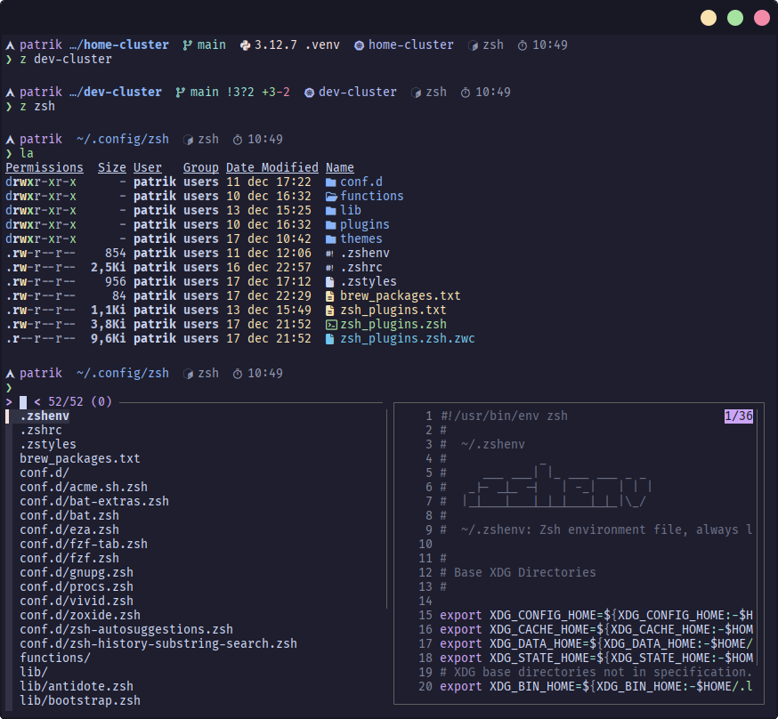

# :house: Dotfiles

<div align="center">
    
</div>

## :information_source: About

Dotfiles repository managed by [**yadm**](https://yadm.io/) (Yet Another Dotfiles Manager).

## :floppy_disk: Install Instructions

Install **yadm** using distribution specific [package manager](https://yadm.io/docs/install#).

### Arch Linux

Install from the [Arch User Repository](https://aur.archlinux.org/packages/?O=0&K=yadm) (AUR) with an [AUR helper](https://wiki.archlinux.org/index.php/AUR_helpers), for example [yay](https://github.com/Jguer/yay).

```
$ yay -S yadm-git
```

### Debian/Ubuntu

Install from the standard package repositories.

```
# apt install yadm
```

### Manual

Standard package repositories are often behind the official GitHub [releases](https://github.com/TheLocehiliosan/yadm/releases). A manual installation using `git clone` is therefore preferred.

```
$ git clone https://github.com/TheLocehiliosan/yadm.git $HOME/.local/share/yadm
$ mkdir -p $HOME/.local/bin; ln -s $HOME/.local/share/yadm/yadm $HOME/.local/bin/yadm
```

### Clone Dotfiles Repository

Clone the dotfiles repository using `yadm`.

```
$ yadm clone https://github.com/pwyde/dotfiles.git
```

#### Force Overwrite of Local Dotfiles

The `clone` and `pull` command may result in warnings because of pre-existing dotfiles. Overwrite the existing files with the commands below.

```
$ yadm fetch --all
$ yadm reset --hard origin/master
```

## :star: Features

### XDG Base Directory Compliance

Dotfiles are organized to comply with [**XDG base directory specification**](https://specifications.freedesktop.org/basedir-spec/basedir-spec-latest.html) as much as possible.

For more information, see [this](https://wiki.archlinux.org/index.php/XDG_Base_Directory) page on the [Arch Wiki](https://wiki.archlinux.org/).

### Bootstrap Script

[yadm](https://yadm.io/) has a built-in [**bootstrap**](https://yadm.io/docs/bootstrap) feature which enables further configuration of dotfiles.

The included bootstrap [script](../.config/yadm/bootstrap) will perform the following tasks:

* Install [applications](#applications-application).
  * If using [**Arch Linux**](https://archlinux.org/), install package dependencies using `pacman` and [AUR helper](https://wiki.archlinux.org/title/AUR_helpers). Supports `paru` and `yay`.
  * If using **Debian**/**Ubuntu**, install package dependencies using [Homebrew](https://brew.sh/).
* Bootstrap [Zsh](#zsh).
  * Prepare Zsh configuration files and directory.
  * Make Zsh the default shell.
  * Add system-wide configuration of `$ZDOTDIR` in `/etc/zsh/zshenv`.
* Bootstrap [Vim](#vim).
  * Prepare Vim configuration files and directory.
  * Automatically install Vim [plugins](#plugin-manager-vim-plug).
* Install [fonts](#fonts) (optional).
* [Cleanup](#cleanup-home-directory) home directory (optional).

### Fonts

Fonts that include glyphs (icons) must be installed on the system to take full advantage of the [themed](#theme) Zsh prompt. Bootstrap script will therefor offer installation of the excellent [**Nerd Fonts**](https://github.com/ryanoasis/nerd-fonts).

Choose between the following font installation options:

1. **None**. Do not install any fonts.
2. **Basic**. Install only [Fira Code](https://github.com/ryanoasis/nerd-fonts/tree/master/patched-fonts/FiraCode) and [Source Code Pro](https://github.com/ryanoasis/nerd-fonts/tree/master/patched-fonts/SourceCodePro) fonts.
3. **Complete**. Install the complete collection of **Nerd Fonts**.

Fonts will be installed in the `~/.local/share/fonts` directory.

### Cleanup Home Directory

Bootstrap script will scan the root of the home directory (`~/`) for known dotfiles. If any are found, the script will prompt them for removal. See [XDG base directory compliance](#xdg-base-directory-compliance) for more information.

## :package: Applications

* [**bat**](https://github.com/sharkdp/bat): A `cat` clone with syntax highlighting and Git integration.
* [**bat-extras**](https://github.com/eth-p/bat-extras): Bash scripts that integrate `bat` with various command line tools.
* [**bottom**](https://github.com/ClementTsang/bottom): A customizable cross-platform graphical process/system monitor for the terminal.
* [**duf**](https://github.com/muesli/duf): Disk usage utility, a better `df` alternative.
* [**dust**](https://github.com/bootandy/dust): A more intuitive version of `du` written in Rust.
* [**eza**](https://github.com/eza-community/eza): A modern, maintained replacement for `ls` and `exa`.
* [**fd**](https://github.com/sharkdp/fd): A simple, fast and user-friendly alternative to `find`.
* [**fzf**](https://github.com/junegunn/fzf): Command-line fuzzy finder.
* [**Git**](https://git-scm.com): Version control system (VCS).
* [**procs**](https://github.com/dalance/procs): A modern replacement for `ps` written in Rust.
* [**ripgrep**](https://github.com/BurntSushi/ripgrep): Replacement for the classic `grep` command written in Rust.
* [**Vim**](https://github.com/vim/vim): Terminal text editor.
* [**vivid**](https://github.com/sharkdp/vivid): A themeable `LS_COLORS` generator with a rich filetype datebase.
* [**zoxide**](https://github.com/ajeetdsouza/zoxide): A smarter `cd` command.
* [**Zsh**](http://zsh.sourceforge.net/Intro/intro_1.html): Preferred shell.

## :shell: Zsh

I enjoy working with the command-line and I do it with [**Zsh**](http://zsh.sourceforge.net/Intro/intro_1.html).

<div align="center">
    
</div>

### Plugin Manager - Antidote

[**Antidote**](https://antidote.sh/) is a fast Zsh plugin manager that performes actions concurrently.

#### Update Antidote & Plugins

Update plugin manager including plugin bundles.

```
$ antidote update
```

### Zsh Plugins

See [`zsh_plugins.txt`](../.config/zsh/zsh_plugins.txt) for a current list of plugins that will be installed.

#### Most Valuable Plugins

* [**zsh-completions**](https://github.com/zsh-users/zsh-completions): Additional completion definitions.
* [**zsh-history-substring-search**](https://github.com/zsh-users/zsh-history-substring-search): [Fish](https://fishshell.com/)-like history search feature.
* [**zsh-autosuggestions**](https://github.com/zsh-users/zsh-autosuggestions): [Fish](https://fishshell.com/)-like fast and unobtrusive autosuggestions.
* [**fast-syntax-highlighting**](https://github.com/zdharma-continuum/fast-syntax-highlighting): [Fish](https://fishshell.com/)-like syntax highlighting (fast implementation).
* [**fzf-tab**](https://github.com/Aloxaf/fzf-tab): Replace Zsh default completion selection menu with [fzf](https://github.com/junegunn/fzf).

### Prompt & Themes

Two types of prompts will be automatically installed:
* [**Starship**](https://github.com/starship/starship): A minimal, blazing-fast, and infinitely customizable prompt.
* [**Oh My Posh**](https://github.com/JanDeDobbeleer/oh-my-posh): Customisable and low-latency cross platform/shell prompt.

Prompt and theme is configured using `zstyle`.

**Starship**:
```
zstyle ':zrc:prompt'  theme  "starship cockpit"
```

**Oh My Posh**:
```
zstyle ':zrc:prompt'  theme  "oh-my-posh pure"
```

Themes are located in a dedicated [`themes`](../.config/zsh/themes) directory. Available themes can be listed with the following custom functions.

```
$ list-themes-starship
Available Starship themes in '/home/user/.config/zsh/themes':
- cockpit

$ list-themes-omp
Available Oh My Posh themes in '/home/user/.config/zsh/themes':
- 1_shell
- catppuccin_mocha
- emodipt-extend
- pure
- star
- tokyonight_storm
- uew
```

## :pencil: Vim

[**Vim**](https://github.com/vim/vim) is my preferred terminal text editor.

<div align="center">
    
</div>

### Plugin Manager - vim-plug

[**vim-plug**](https://github.com/junegunn/vim-plug) is a minimalistic plugin manager for Vim.

#### Upgrade vim-plug

```
:PlugUpgrade
```

#### Update Plugins

```
:PlugUpdate
```

#### Remove Unlisted Plugins

```
:PlugClean
```

### Most Valuable Vim Plugins

* [**vim-plug**](https://github.com/junegunn/vim-plug): Manages Vim plugins.
* [**NERDTree**](https://github.com/scrooloose/nerdtree): File system explorer.
* [**vim-nerdtree-syntax-highlight**](https://github.com/tiagofumo/vim-nerdtree-syntax-highlight): Add color & icons to NERDTree.
* [**nerdtree-git-plugin**](https://github.com/Xuyuanp/nerdtree-git-plugin): NERDTree showing git status flags.
* [**VimDevIcons**](https://github.com/ryanoasis/vim-devicons): Adds icons to Vim plugins.
* [**vim-airline**](https://github.com/vim-airline/vim-airline): Lean & mean status/tabline.
* [**Startify**](https://github.com/mhinz/vim-startify): Vim start screen.
* [**Fugitive**](https://github.com/tpope/vim-fugitive): Adds Git support.
* [**vim-gitgutter**](https://github.com/airblade/vim-gitgutter): Shows a `git diff` in the "gutter" (sign column).
* [**vim-numbertoggle**](https://github.com/jeffkreeftmeijer/vim-numbertoggle): Enable "hybrid" line numbers.
* [**CtrlP**](https://github.com/ctrlpvim/ctrlp.vim): Full path fuzzy file, buffer, mru, tag, ... finder.
* [**DeleteTrailingWhitespace**](https://github.com/vim-scripts/DeleteTrailingWhitespace): Delete unwanted whitespace at the end of lines.
* [**Catppuccin theme**](https://github.com/catppuccin/vim): Soothing pastel theme for Vim.

## :heart: Credits

- **Dotfiles Banner**: Inspired by [zSucrilhos's](https://github.com/zSucrilhos) dotfiles [README.md](https://github.com/zSucrilhos/dotfiles/blob/master/README.md) file.
- **Zsh Configuration**: Inspired and borrowed code from [mattmc3's](https://github.com/mattmc3/) GitHub repositories such as [Zephyr](https://github.com/mattmc3/zephyr) and [.zshrc1](https://github.com/mattmc3/zshrc1).

## :page_with_curl: License

Dotfiles made public under the [MIT license](LICENSE).
